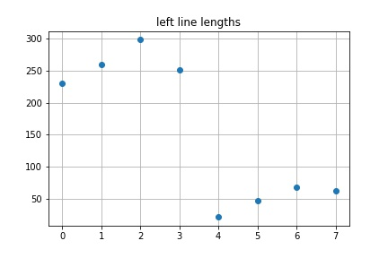
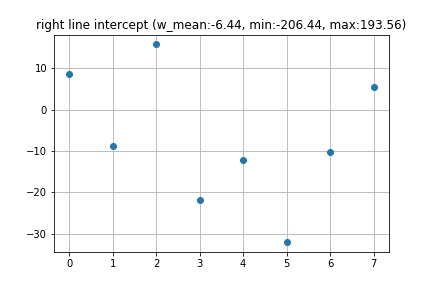
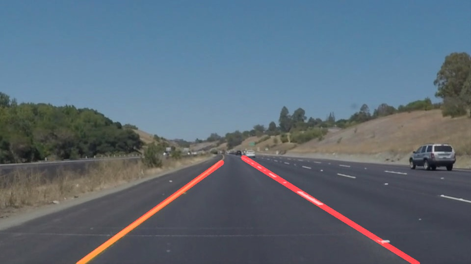

# **Finding Lane Lines on the Road** 

## Description

The goal of this project was to find the lane lines on the road from an image. The source of the images is a camera mounted to the front of the car. The lane lines were found using only computer vision techniques within the pipeline

## Summary of Pipeline

The following is a top level description of the pipeline used to detect the lane lines

* Color threshold mask
* Grayscale conversion
* Gaussian blur filter
* Canny edge detection
* Region masking
* Color threshold mask application
* Hough line transform
* Line filtering
* Combining with weighting 

## Pipeline Details

The image below is an example of one of the inputs to the pipeline for detecting the lane lines. The goal is to detect only the lane lines that correspond to the occupied lane. The lane lines can be either yellow or white and could be solid or dashed

**Color threshold mask**

In the first step before grayscale conversion a mask is computed based on a color thresholding for yellow and white. This mask will be applied later in the pipeline before the hough lines transformation. It should not be applied as the first step as we would then get artificial edges that would be detected by the canny edge detection algorithm.
The exact threshold to use for the R,G,B filtering needs to be tuned based on the inputs. The color thresholding is very sensitive to lighting. Applying a higher threshold might produce good results for certain frames but could accidently filter out lane lines in another frame.

Image on the left is a mask with a low threshold `[100 100 0]`, image on the right is a mask with a high threshold `[140 140 0]`
The lower threshold was used in this project

---
**Grayscale conversion**

The image is then converted to grayscale in order to combine the channels into one for the rest of the pipeline. The OpenCV function `cv2.cvtColor` is used with `cv2.COLOR_RGB2GRAY` as the argument

---
**Gaussian blur filter**

Prior to inputting the image to the Canny edge detection algorithm, a Gaussian blur/smoothing filter is applied to reduce the potential image noise. This should enhance the performance of the edge detection algorithm. The OpenCV function `cv2.GaussianBlur` is used with a kernel size of `3`

---
**Canny edge detection**

The next step of the pipeline uses the Canny edge detection algorithm to detect and draw the pixels associated with edges in the image. The threshold values of `40` and `150` are used for the min and max values needed for the hysteresis thresholding within the algorithm

---
**Region masking**

The output of the Canny edge detector finds multiple edges, most of which are not relavant to finding the lane lines. Since the region for the lane lines is roughly known (center perspective of the car), a trapezoidal area can be defined as a mask to filter out the edges. 4 vertices that specify a quadrilateral are defined and used to create an image with the region of interest using `cv2.fillPoly`. The mask is then applied to the main image using `cv2.bitwise_and`

---
**Color threshold mask application**

The mask that was obtained from the color threshold operation earlier is now applied. This adds another layer of masking operation to remove any unwanted edges within the region of interest. The mask is applied by setting the pixel values of those that were below the threshold to `0`

---
**Hough line transform**

After finding all the pixels associated with edges in the region of interest, the next step is to compute which set of pixels belong to the same line. 

The Hough transform accomplishes this by finding all the points that are co-linear. Every edge pixel is transformed into the Hough space parametrized by ρ and θ using ρ = x\*cos(θ) + y\*sin(θ) where ρ is the distance to the origin and θ is the angle between the x-axis and the line connecting the origin and the pixel point. 

θ is swept from 0 to 2π in some discrete step. This is equivalent to drawing a line through an edge pixel that goes through every angle 0 to 2π and tabulating/accumulating the ρ and θ values. When this procedure is applied for all the edge pixels, the ρ and θ pairs with the highest accumulated "votes" represent lines in the original image

The OpenCV function `cv2.HoughLinesP` is used with the following parameters
* ρ = 1 (distance resolution in pixels of the Hough grid)
* 0 = π/180 (angular resolution in radians of the Hough grid)
* threshold = 35 (minimum number of votes required)
* min_line_len = 2 (minimum number of pixels required for making up a line)
* max_line_gap = 30 (maximum gap in pixels between line segments)

---
**Line filtering**

The output image from the Hough transform will have multiple line segments. This step of the pipeline implemented in the `draw_lines` routine will use these segments to compute 2 line segments, one for the left lane and one for the right lane.

For each line segment, the slope, y-intercept, and the length is computed. Each segment is then sorted as either the left lane or the right lane based on the slope. Any segments that have a very steep or flat slope are ignored. The images show the result of this sorting

There can still be some outlier line segments so another filtering step is performed. The weighted means of the slopes and intercept is computed using the length of the segment squared for the weighting. The weighted means are then used to define a range for keeping the line segments (see image titles above)

The mean of the final filtered list for the left and right lane segments is then used to compute the slope and intercept of the left and right lane
The two end points (x1,y1) and (x2,y2) for each line are:
* y1: bottom of the image, x1: determined from equation of the line
* x2: point furthest to the right or left depending on the lane, y2: determined from equation of the line

The end points are also adjusted to avoid the 2 lanes crossing each other

The two final line segments representing the left and right lane are shown below

---
**Combining with weighting**

The final output of the pipeline is a weighted combination of the input image and the image containing the detected left and right lane line segments. The image is computed using `α*initial_img + β*line_img + γ`. The OpenCV function `cv2.addWeighted` is used with the parameters `α=0.8, β=1, γ=0`

---

## Test Images

## Test Videos

**solidWhiteRight**

**solidYellowLeft**

**challenge**

## Potential Issues

* Very sensitive to the lighting conditions. This can affect the color thresholding as well as the edge detction to find the lanes
* Does not detect curved lanes as we are only checking for co-linear points in the Hough transform

## Possible Improvements

* Fitting higher order polynomials through regression to better fit curved lines
* Parametrize the lane lines between frames in order to smooth the transition
