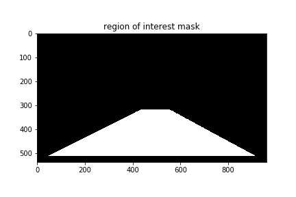

# **Finding Lane Lines on the Road** 

## Description

The goal of this project was to find the lane lines on the road from an image. The source of the images is a camera mounted to the front of the car. The lane lines were found using only computer vision techniques within the pipeline

## Summary of Pipeline

The following is a top level description of the pipeline used to detect the lane lines

* Color threshold mask
* Grayscale conversion
* Gaussian blur filter
* Canny edge detection
* Region masking
* Color threshold mask application
* Hough line transform
* Line filtering
* Combine with weighting 

## Pipeline Details

The image below is an example of one of the inputs to the pipeline for detecting the lane lines. The goal is to detect only the lane lines that correspond to the occupied lane. The lane lines can be either yellow or white and could be solid or dashed

**Color threshold mask**

In the first step before grayscale conversion a mask is computed based on a color thresholding for yellow and white. This mask will be applied later in the pipeline before the hough lines transformation. It should not be used as the first step as we would then get artificial edges that would be detected by the canny edge detection algorithm.
The exact threshold to use for the R,G,B filtering needs to be tuned based on the inputs. The color thresholding is very sensitive to lighting. Applying a higher threshold might produce good results for certain frames but could accidently filter out lane lines in another frame.

Image on the left is a mask with a low threshold `[100 100 0]`, image on the right is a mask with a high threshold `[140 140 0]`
The lower threshold was used in this project

---
**Grayscale conversion**

The image is then converted to grayscale in order to combine the channels into one for the rest of the pipeline. The OpenCV function `cv2.cvtColor` is used with `cv2.COLOR_RGB2GRAY` as the argument

---
**Gaussian blur filter**

Prior to inputting the image to the Canny edge detection algorithm, a Gaussian blur/smoothing filter is applied to reduce the potential image noise. This should enhance the performance of the edge detection
The OpenCV function `cv2.GaussianBlur` is used with a kernel size of `3`

---
**Canny edge detection**

The next step of the pipeline uses the Canny edge detection algorithm to detect and draw the edges in the image. The threshold values of `50` and `150` are used for the min and max values needed for the hysteresis thresholding within the algorithm

---
**Region masking**

The output of the Canny edge detector finds multiple edges, most of which are not relavant to finding the lane lines. Since the region for the lane lines is roughly known (center perspective of car), a trapezoidal area can be defined as a mask to filter out the edges. 4 vertices that specify a quadrilateral are defined and used to create an image with the region of interest using `cv2.fillPoly`. The mask is then applied to the main image using `cv2.bitwise_and`

---
**Color threshold mask application**

The mask that was obtained from the color threshold operation earlier is now applied. This adds another layer of masking operation to remove any unwanted edges within the region of interest. In this particular example no additional edges were filtered. The mask is applied by setting the pixel values of those that were below the threshold to `0`

---
**Hough line transform**

---
**Line filtering**

---
**Combine with weighting**

The final output of the pipeline is a weighted combination of the input image and the image containing the detected left and right lane. The image is computed using `α*initial_img + β*line_img + γ`. The OpenCV function `cv2.addWeighted` is used with the parameters `α=0.8, β=1, γ=0`

---

## Test Videos

**solidWhiteRight**

**solidYellowLeft**

**challenge**

## Potential Issues

## Possible Improvements
